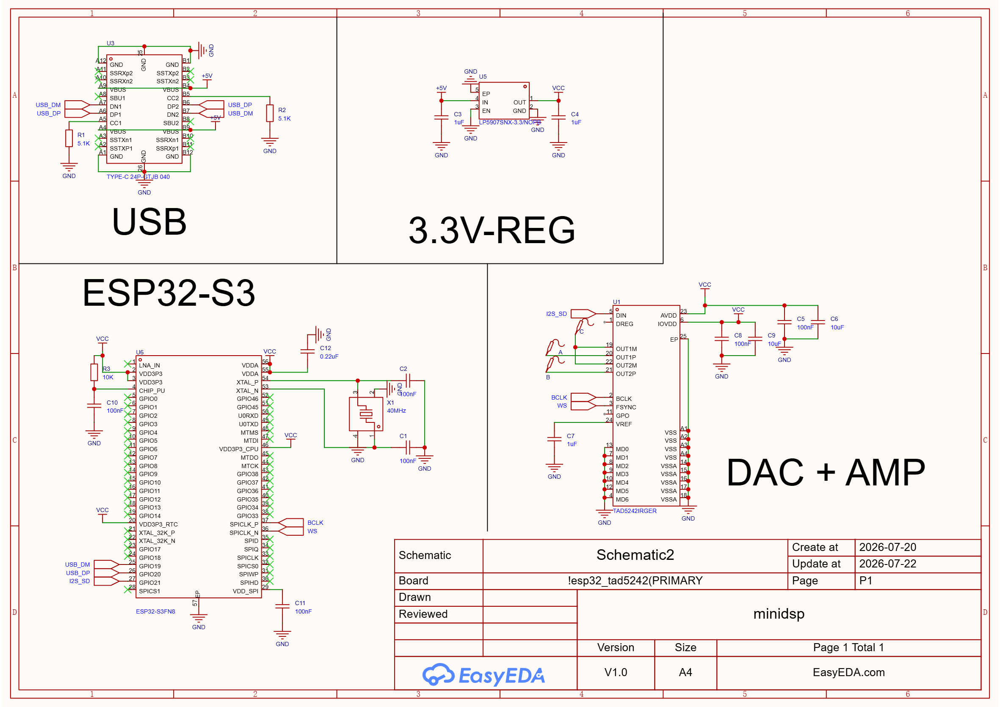

# The PCB
# Ordering Information (! IMPORTANT !)
- Order from JLCPCB: [https://jlcpcb.com/](https://jlcpcb.com/)
- 4-layer PCB
- 0.8mm thickness

# PCB Files
- [**BOM**](./BOM.csv)
- [**Gerber Files**](./Gerber_PCB2_2026-07-22.zip)
- [**Pick and Place Files**](./PickAndPlace_PCB2_2026_07_22.xlsx)
- [**Schematic**](./SCH_Schematic2_2026-07-22.pdf)
## Active Components
| Part | Quantity | Link |
|------|----------|------|
| TAD5242IRGER (DAC / AMP) | 1 | https://www.lcsc.com/product-detail/C42414591.html |
| Type-C Male Connector | 5 | https://www.lcsc.com/product-detail/C3151751.html |
| 40MHz Crystal | 10 | https://www.lcsc.com/product-detail/C20885029.html |
| 3.3V LDO (LP5907SNX-3.3/NOPB) | 5 | https://www.lcsc.com/product-detail/C133572.html |
| ESP32-S3FN8 | 1 | https://www.lcsc.com/product-detail/C2913196.html | 
## Passive Components
| Part | Min. Quantity | Link |
| ------ | ------------- | ---- |
| 220nF ±10% 25V Ceramic Capacitor X7R 0402 | 50 | https://www.lcsc.com/product-detail/C915854.html |
| 100nF ±10% 16V Ceramic Capacitor X7R 0402 | 100 | https://www.lcsc.com/product-detail/C1525.html |
| 10uF ±20% 25V Ceramic Capacitor X5R 0603 | 20 | https://www.lcsc.com/product-detail/C96446.html |
| 1uF ±10% 25V Ceramic Capacitor X5R 0402 | 20 | https://www.lcsc.com/product-detail/C52923.html |
| 10kΩ ±5% 62.5mW 0402 Thick Film Resistor | 100 | https://www.lcsc.com/product-detail/C2906885.html |
| 5.1kΩ ±5% 62.5mW 0402 Thick Film Resistor | 100 | https://www.lcsc.com/product-detail/C2906948.html |

# Schematic

