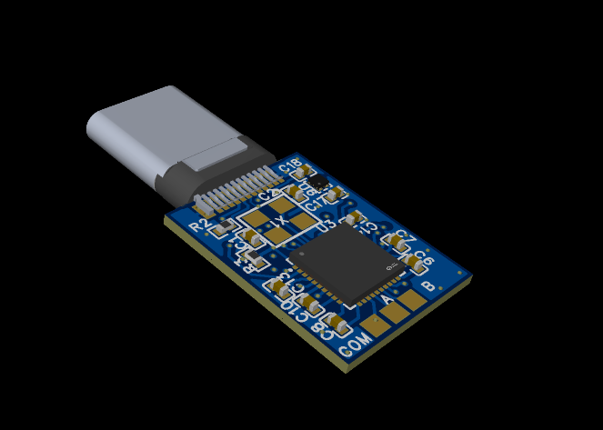

# MicroDSP
        
A tiny USB-C DAC + DSP for to add integrated PEQ for wired earphones or headphones.
## Why Did I Make This?
I have a pair of wired earphones that sound perfect - but only when measured and equalized. However, it is difficult to install and use a parametric equalizer on every device - so I made the MicroDSP. It's barely bigger than the USB-C connector and  provides both a Hi-Fi DAC and a DSP theoretically capable of 40 PEQ bands.
## How Does It Work?
- The MicroDSP uses an ESP32-S3 microcontroller along with the TAD5242 DAC/AMP to process USB audio, apply a parametric equalizer or other DSP effects, and output the audio to a wired headphone.
- The ESP32-S3 is a powerful microcontroller with a built-in USB interface along with a 240MHZ dual-core processor. All wireless functionality is not used. 
- The TAD5242 is a low-cost but high performance DAC + Heapdhone amplifier, providing a 110dB SNR, –96dB THD+N with a 1VRMS output. It is capable of driving headphones with impedances from 16Ω to 600Ω.
## [The PCB](PCB/)
