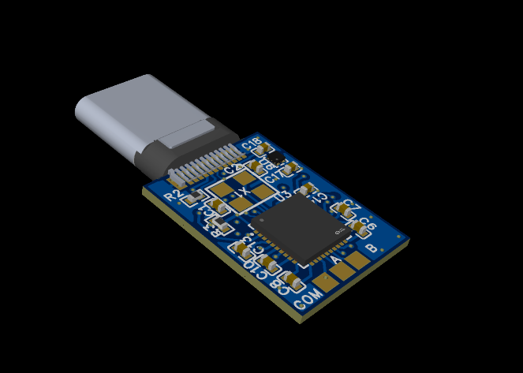

# MicroDSP
        
A tiny USB-C DAC + DSP for to add integrated PEQ for wired earphones or headphones.
## Why Did I Make This?
I have a pair of wired earphones that sound perfect - but only when measured and equalized. However, it is difficult to install and use a parametric equalizer on every device - so I made the MicroDSP. It's barely bigger than the USB-C connector and  provides both a Hi-Fi DAC and a DSP theoretically capable of 40 PEQ bands.
## How Does It Work?
- The MicroDSP uses an ESP32-S3 microcontroller along with the TAD5242 DAC/AMP to process USB audio, apply a parametric equalizer or other DSP effects, and output the audio to a wired headphone.
- The ESP32-S3 is a powerful microcontroller with a built-in USB interface along with a 240MHZ dual-core processor. All wireless functionality is not used. 
- The TAD5242 is a low-cost but high performance DAC + Heapdhone amplifier, providing a 110dB SNR, –96dB THD+N with a 1VRMS output. It is capable of driving headphones with impedances from 16Ω to 600Ω.
## [BOM](./PCB/BOM.csv)
### Active Components
| Part | Quantity | Link |
|------|----------|------|
| TAD5242IRGER (DAC / AMP) | 1 | https://www.lcsc.com/product-detail/C42414591.html |
| Type-C Male Connector | 5 | https://www.lcsc.com/product-detail/C3151751.html |
| 40MHz Crystal | 10 | https://www.lcsc.com/product-detail/C20885029.html |
| 3.3V LDO (LP5907SNX-3.3/NOPB) | 5 | https://www.lcsc.com/product-detail/C133572.html |
| ESP32-S3FN8 | 1 | https://www.lcsc.com/product-detail/C2913196.html | 
### Passive Components
| Part | Min. Quantity | Link |
| ------ | ------------- | ---- |
| 220nF ±10% 25V Ceramic Capacitor X7R 0402 | 50 | https://www.lcsc.com/product-detail/C915854.html |
| 100nF ±10% 16V Ceramic Capacitor X7R 0402 | 100 | https://www.lcsc.com/product-detail/C1525.html |
| 10uF ±20% 25V Ceramic Capacitor X5R 0603 | 20 | https://www.lcsc.com/product-detail/C96446.html |
| 1uF ±10% 25V Ceramic Capacitor X5R 0402 | 20 | https://www.lcsc.com/product-detail/C52923.html |
| 10kΩ ±5% 62.5mW 0402 Thick Film Resistor | 100 | https://www.lcsc.com/product-detail/C2906885.html |
| 5.1kΩ ±5% 62.5mW 0402 Thick Film Resistor | 100 | https://www.lcsc.com/product-detail/C2906948.html |
## [The PCB](PCB/)
## [The Code](https://github.com/Pasqalup/MicroDSP-ESP32)
## [OSHWLab](https://oshwlab.com/pasqalup25/project_qbubpsfj)
